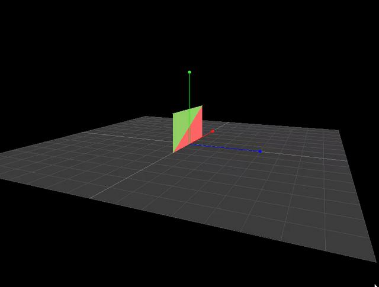
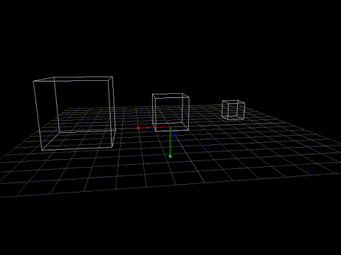
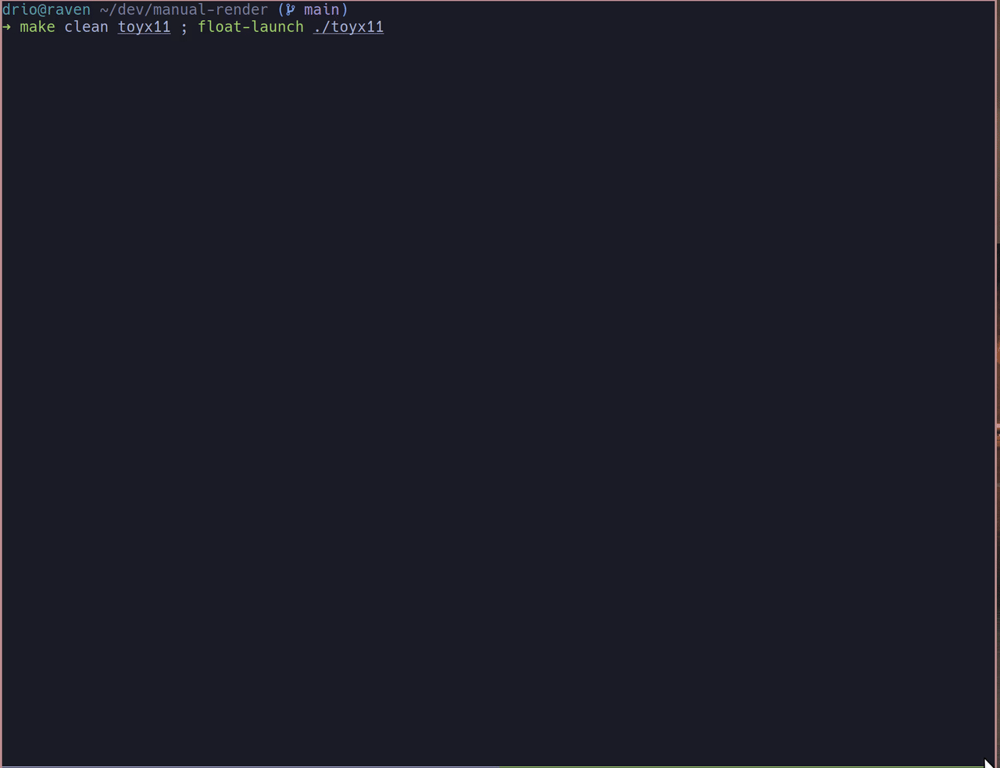

This is a repo to learn the math behind rendering 2D/3D scenes.

## 07: Triangle rasterization



Adding triangle rasterization. I am already dropping frames!
We need shaders asap.

I did also quite a bit of refactoring. Now we have geometry hashes
that describe how to create the different objects in the scene. Then
we have a scene object that defines the actual instances of those objects
in our scene. Before that I had a mix and match between geometries and
the scene. Now, all the objects are created from the geometry objects and
then we scale them.

Within the geometries, we define what triangles we have in that geometry.
We define triangles as three vertex values. We also associate a color and 
a name per each triangle.

In the main loop, we call the render scene function that goes over the scene
objects and calls the specific function that renders it. The render function
first creates the vertices of all the triangles in the geometry. Per each
vertex, we project the 3d point to 2d. Then we call the rasterice function.
This function, creates a bounding box around the triangle and then goes over
all the points in the triangle to determine if a point is within the triangle.
If it is, it paints it. There is a dedicated function for that answers the
question: Given a triangle with vertices A, B, C and a point P, how do we
know if P is inside the triangle? It uses barycentric coordinates which you
can use to determine if P is within the triangle. 

The next thing is z buffering. The Problem: When multiple triangles occupy the
same screen pixel, which one should be visible? Currently your pipeline renders
in scene order, not depth order.

### What's next?

Core Missing Pieces

1. Z-buffering - proper depth handling.
2. Attribute interpolation - Currently I interpolate depth, but shaders interpolate many attributes
(colors, texture coordinates, normals) across triangle surfaces.
    - Normals are vectors that point perpendicular to a surface. If you have that info, then you
      can use it to implement culling (don't render faces pointing away).
    - UV coordinates: This are coordinates that we use to map textures into our triangles. The UV coordinates
      go between (0-1) and (0-1). In our geometries, we define what UV coordinates you want to use in a pariticular
      triangle for a particular object.
3. Per-pixel operations - my pipeline does per-triangle operations; shaders work per-pixel.

Shaders will replace:

- Vertex Shader: Your project_3d_to_2d() and matrix transformations
- Fragment Shader: Your rasterize_triangle() color decisions

With z-buffering + attribute interpolation, the pipeline will become:

This becomes "vertex shader-like":

```py
    for vertex in triangle_vertices:
      screen_pos, depth, color = transform_vertex(vertex)
```

This becomes "fragment shader-like":
```py
    for pixel in triangle:
      interpolated_color = interpolate_attributes(pixel_pos, vertex_colors)
      if depth_test_passes(pixel_depth):
          set_pixel_color(interpolated_color)
```

Z-buffering alone gets you proper 3D rendering. But adding attribute interpolation (colors, texture coordinates)
across triangle surfaces makes the conceptual jump to shaders much clearer - because that's exactly what
fragment shaders do: take interpolated attributes and compute final pixel colors.

So: z-buffering for correctness, attribute interpolation for shader readiness.

So probably next steps are:

1. Implement z_buffer and confirm we can hide objects based on the camera position.
2. Map a texture in my vertical plane

## 06: Orbit Camera Movement

I’ve refactored the camera a bit — it now orbits around the scene.



What’s next? I think it’s time to move to shaders, so we can offload all the
computations to the GPU. Right now, we're doing everything via "software
rendering."

What are Shaders, and How Do They Relate to Textures? Shaders are small
programs that run directly on your graphics card (GPU), not the CPU.

Instead of our current approach:

- Calculate 3D-to-2D projection in Python
- Draw lines and points using SDL2's 2D functions
- Handle everything pixel-by-pixel on the CPU

We could:

- Send 3D vertex data directly to the GPU
- Use vertex shaders to handle the 3D-to-2D projection
- Use fragment shaders to compute the final pixel colors (including textures)

Render entire triangles and polygons in a single GPU operation.

We'll write code for these shaders, and that code runs on the GPU.

Vertex Shaders handle the projection and transformation of vertices, doing in
parallel what we're currently doing manually in Python.

Fragment (Pixel) Shaders run for every pixel on the screen. They compute the
final color based on lighting, textures, materials, etc.

After that I think I will have a good mental model to use any 3d library 
with confidence.


### What Are Shaders and How Do They Relate to Textures?

Shaders are small programs that run directly on your graphics card (GPU) rather
than your CPU. 

Instead of our current approach:

Calculate 3D-to-2D projection in Python
Draw lines and points using SDL2's 2D functions
Handle everything pixel by pixel on the CPU

We could:

Send our 3D vertex data directly to the GPU.
Let vertex shaders handle the 3D-to-2D projection.
Let fragment shaders compute the final pixel colors, including textures
Render entire triangles/polygons in single GPU operations.

We write code for those shaders and that code runs in the cpu.

Fragment/Pixel Shaders: These run for every pixel that gets drawn on screen and
can compute the final color of each pixel based on textures, lighting,
materials, and other factors.

Vertex Shaders: These handle the 3D-to-2D projection that you're currently
doing in Python, but they do it on the GPU for thousands of vertices
simultaneously.

Fun fun fun!


## 05: python and camera position plus perspective projection

I moved to python (still controlling everything at pixel level). Just wanted to be able
to prototype quicker. 

The projection from 3d to 2d is now more advance. First, we use a perspective projection
which means is more realistic. Also, tell the camera what should it be looking at. 

Writing the 3d to 2d projection manually was a great idea. Basically we can replace each
of the steps of the pipeline with a matrix. And then we can multiple them to create a 
single matrix that encodes the transformations you want to do with your vertices. 
Something that tripped me of a little bit is the fact that you have use 4 dimension matrices
on our 3d vertices but that is necessary for the math "to work" and compute the transformations
we want.

I switched to Python (still controlling everything at the pixel level) to
prototype more quickly.

The 3D-to-2D projection is now more advanced. I'm using a perspective
projection, which gives a more realistic result. The camera also has a target
now. We can tell it what to look at.

Writing the projection pipeline by hand turned out to be a great decision. Each
stage of the transformation can be represented as a matrix. By multiplying
them, we get a single matrix that encodes all the transformations applied to
the vertices.

One thing that tripped me up a bit: we have to use 4D vectors for 3D points.
It's necessary for the math to work out, especially for perspective division
and other transformations.


##  04: Moving to 3d and refactoring to separate concerns in the rendering pipeline

NOTE: no gif for this step since we haven't added anything extra really.

I have removed the rendering of textures for now. We need to stay with the basics.

Now we have just points and lines but they use 3D coordinates.

In the rendering loop, we render the scene and from there we make calls to world_to_screen_pipeline
which now calls three separate functions to "pipeline" the different transformations that
we do to view our 3D world on a 2D screen:

1. World → View (world_to_view)
- Purpose: Make camera the center of the universe.
Everything is positioned relative to the camera (we are in our world space).

2. View → Projection (apply_perspective)
- Purpose: Apply perspective - far things look smaller by dividing X,Y by Z distance
- This creates the illusion of depth on a flat 2D screen

3. Projection → Screen (projection_to_screen)
- Purpose: Map to actual pixel coordinates

The key insight: each step isolates one type of transformation, making the math
clean and debuggable. Instead of mixing camera position + perspective + screen
mapping in one complex formula, we do each step separately.

Notice there is no zoom now. The zoom is really changing our z coordinate in the camera.

We also fixed a bug where objects behind the camera would reappear flipped.
Now we properly clip objects that are behind the camera or too close (near plane).

I think now we are in good shape to apply matrices instead of applying math on each point
coordinate.

What is next? Adding Camera Rotation (Leading to Matrices)

Goal: Add camera rotation capability (look around with mouse/keys), which will naturally force us into
matrix transformations. Currently our camera can only move around but always looks straight ahead down
the Z-axis. We want to add yaw (left/right looking) and pitch (up/down looking) like any first-person
game.

We can start by implementing rotation math manually in world_to_view() with trigonometry. As
we add more rotation axes (yaw + pitch + roll), the coordinate transformations will become very complex with
9+ trigonometric calculations per point. This complexity wall will make us desperately need matrices to
manage the math cleanly. We'll learn matrices out of necessity to solve a real problem, not just
because they're "the right way".


## 03: Drawing images

I wanted to add a raster image (png) into my world. 
The process is the same as vectors. We need to know what position and space
the new object is going to take in our world, we define this type to capture that:

```c
typedef struct {
    float x, y;          // World position
    float width, height; // World dimensions
    Texture2D texture;   // The loaded texture
} WorldImage;
```

Then we need to map that object (the rectangle) from the world to the camera/screen. 

For that we have a dedicated function that performs the map and uses raylib to render
the image into the screen.


## 02: Migrating to raylib 

I wanted to start with X11 to make sure I had full control of what I was doing. 
Turns out I can still use [raylib](https://www.raylib.com/cheatsheet/cheatsheet.html) and
still keep all the control. Basically I just use raylib to draw pixels. You can see the
migration ([commit here](https://github.com/drio/manual-render/commit/81569a4d56458539322e577ebe107681cff34067)).

## 01: A note on the implementation

The purpose of this project is to learn from the bottom up. For that reason, it’s
all written in C, using the X11 library directly.

Now that I understand the basics, I’m going to move to
[raylib](https://www.raylib.com). I’ll still code from first principles, but I
won’t have to deal with the outdated API of X11 just to paint pixels on the screen.




What you are seeing here is a 2D "scene" where we have four 2D vectors (points)
in space. The key observation is that we are working in our world whatever that
is. And we have units. Our objects will be created by just adding
points/vectors (and other things like lines) in our world.

For example, what you are looking at has:

```c
Point points[] = {
    {0, 0}, {2, 0}, {2, 2}, {0, 2}
};

Line lines[] = {
    {{0, 0}, {2, 0}},
    {{2, 0}, {2, 2}},
    {{2, 2}, {0, 2}},
    {{0, 2}, {0, 0}}
};
```

Now, what we are saying here is that our world has a vector at (0,0) - zero
units in x and zero units in y. Those units can be whatever we want. It could
be GPS coordinates to define our objects in our "real" world.

The next step to build a solid mental model is the camera. The camera looks at
our world, but the camera has a viewfinder/LCD screen that is limited in space.
Our world is limitless. It is infinite.

So we are trying to answer:

“Where should I draw that on a 800×600 screen so it appears in the right place,
given the camera position and zoom?”

Our camera defines:

1. center_x, center_y: what world point is the center of the screen.
2. zoom: how many pixels per world unit.

We need to map between our world and the camera. For that we have:

```c
Point world_to_screen(float world_x, float world_y, Camera* cam, int screen_width, int screen_height) {
    Point screen_point;
    screen_point.x = (int)((world_x - cam->center_x) * cam->zoom + screen_width / 2);
    screen_point.y = (int)((world_y - cam->center_y) * cam->zoom + screen_height / 2);
    return screen_point;
}
```


Let's unpack that:


### 1. Translate world so the camera is at (0,0)

We want the camera to behave like a viewer at the origin looking around. For
that we answer: How far is the current vector/point from where the camera is
looking?

```txt
# example 1
wx = 1.5, wy = 0.5
camera.center = (1.0, 1.0)

tx = 1.5 - 1.0 = 0.5
ty = 0.5 - 1.0 = -0.5

Point (1.5, 0.5) is (0.5, -0.5) units from the camera view point (1.0, 1.0).

# example 2
wx = 0, wy = 0
camera.center = (2, 2)

tx = 0 - 2 = -2
ty = 0 - 2 = -2

Point (0, 0) is (-2, -2) units from the camera view point (2,2).

```

Insight: There is no concept of "center" in our world, just locations.
But we do have a center in our screen/camera view.


## 2. Scale relative position into pixels

That's an easy one (for 2D!). We just need to multiply by our zoom factor.

## 3. Move to the center of the screen

We want the camera’s focus point (camera.center) to be drawn at the center of
the screen. So we shift everything by (screen_width / 2, screen_height / 2).

## The mental model

To build more intuition, I think about this:

Imagine that our world is a piece of infinite paper. We start drawing things on
it (points for now). This is your world - it extends forever in all directions.

Now we have a piece of paper with a hole in a rectangle shape. It’s placed
parallel to the infinite paper. The size of the rectangle is our screen, and it
has fixed dimensions.

Now, this hole is at some distance from the infinite paper. That distance is
our zoom.

## Future work

We are only doing a few "transformations". We could also: rotate, project
(tilt the window), skew, and more.

Our world (in this example - not the real one!) is a flat infinite plane.
Object sizes never change because the distance to our camera is always the same.
Which is fine for now. We can still have tons of fun.

Right now, we apply the math point by point, coordinate by coordinate.
Linear algebra and matrix multiplication will allow us to perform these
computations in a more efficient and general way.
